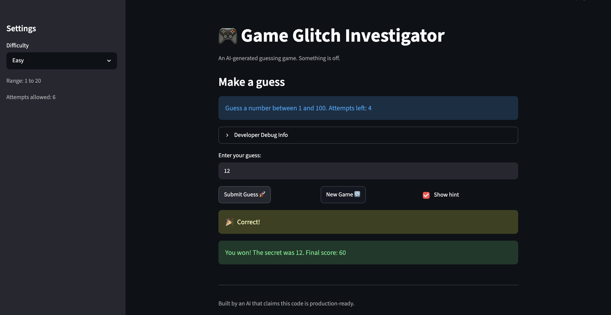
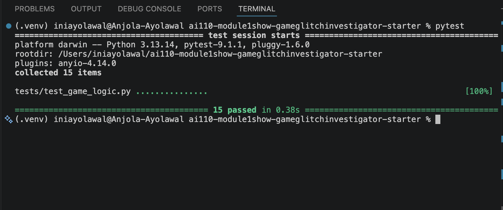

# 🎮 Game Glitch Investigator: The Impossible Guesser

## 🚨 The Situation

You asked an AI to build a simple "Number Guessing Game" using Streamlit.
It wrote the code, ran away, and now the game is unplayable. 

- You can't win.
- The hints lie to you.
- The secret number seems to have commitment issues.

## 🛠️ Setup

1. Install dependencies: `pip install -r requirements.txt`
2. Run the broken app: `python -m streamlit run app.py`

## 🕵️‍♂️ Your Mission

1. **Play the game.** Open the "Developer Debug Info" tab in the app to see the secret number. Try to win.
2. **Find the State Bug.** Why does the secret number change every time you click "Submit"? Ask ChatGPT: *"How do I keep a variable from resetting in Streamlit when I click a button?"*
3. **Fix the Logic.** The hints ("Higher/Lower") are wrong. Fix them.
4. **Refactor & Test.** - Move the logic into `logic_utils.py`.
   - Run `pytest` in your terminal.
   - Keep fixing until all tests pass!

## 📝 Document Your Experience

- [ ] Describe the game's purpose.
- [ ] Detail which bugs you found.
- [ ] Explain what fixes you applied.

 Glitchy Guesser is a number-guessing game built with Streamlit. Players select a difficulty level and attempt to guess a randomly generated secret number within a limited number of attempts. The game provides hints after each guess, tracks score, and allows players to start a new game when they finish.

Bugs Found
- Hint messages were reversed.
- New Game did not fully reset score, history or game state.
- Invalid input consumed attempts.
- Difficulty settings were inconsistent.
- Hard mode used a smaller range than Normal mode, making it easier.
- The secret number was sometimes converted to a string, causing incorrect comparisons.
- Attempts started at 1, reducing the displayed attempts remaining before any guesses.

Fixes Applied
- Corrected hint-direction logic in `check_guess()`.

- Refactored New Game reset functionality into reusable logic.

- Updated New Game to respect selected difficulty ranges.

- Added tests to verify gameplay behavior.

What I Learned
AI was useful for identifying potential causes and suggesting refactors, but I still needed to review code changes carefully, verify behavior manually, and validate fixes using pytest.

## 📸 Demo Walkthrough

Describe your fixed game in numbered steps so a reader can follow along without watching a video:

1. User starts a new game on Normal difficulty.
2. The game generates a secret number within the Easy difficulty range.
3. User enters a guess of 30.
4. The game correctly identifies the guess as too low and displays a "Go Higher" hint.
5. User enters a guess of 50.
6. The game correctly identifies the guess as too high and displays a "Go Lower" hint.
7. User enters the correct guess.
8. The game displays a win message and updates the score.
9. User clicks New Game.
10. The game resets the secret number, score, history, attempts, and game status, allowing a fresh game to begin.

**Screenshot** *(optional)*: <!-- Insert a screenshot of your fixed, winning game here -->


## 🧪 Test Results

```
# Paste your pytest output here, e.g.:
# pytest tests/
# ========================= X passed in 0.XXs =========================
```
(.venv) iniayolawal@Anjola-Ayolawal ai110-module1show-gameglitchinvestigator-starter % pytest
======================================= test session starts ========================================
platform darwin -- Python 3.13.14, pytest-9.1.1, pluggy-1.6.0
rootdir: /Users/iniayolawal/ai110-module1show-gameglitchinvestigator-starter
plugins: anyio-4.14.0
collected 15 items                                                                               
tests/test_game_logic.py ...............                                                     [100%]

======================================== 15 passed in 0.12s ========================================

## 🚀 Stretch Features

- [ ] [If you choose to complete Challenge 4, describe the Enhanced UI changes here — a screenshot is optional]
